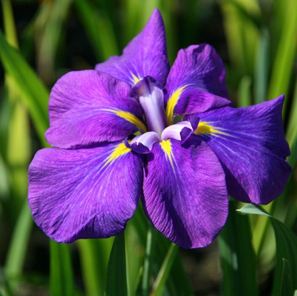

<style>
.forceBreak { -webkit-column-break-after: always; break-after: column; }
</style>

```{css, echo = FALSE}
pre {
  max-height: 700px;
  overflow-y: auto;
}

pre[class] {
  max-height: 400px;
}

.scroll-100 {
  max-height: 500px;
  overflow-y: auto;
  background-color: inherit;
}
```

```{r setup, include=FALSE}
knitr::opts_chunk$set(echo = FALSE)
dati = iris
```

# Prima sezione

## Seconda slide con titolo

- Bullet 1
- Bullet 2
- Bullet 3

```{r, fig.cap = "Fiorellino", fig.align="center", out.width="50%"}
knitr::include_graphics(path = "img/iris_albicans (3).jpg")
```

## Terza slide

Fiore bianco fiore <font size="3">rosso</font> fiore <span style="color:violet">viola</span> 

## Quarta slide {.columns-2 .build} 

<div>

In seguito alla deposizione la femmina torna velocemente in mare aperto poiché è lei che si occupa della ricerca di cibo in questa fase.

</div> 

il maschio si occuperà di covare tenendo l’uovo sulle zampe, proteggendolo dal ghiaccio grazie ad una piega cutanea presente sul ventre, e aspettando il ritorno della femmina per la schiusa, dopo circa 65 giorni.

</div>

<p class="forceBreak"></p>

Il ritorno della femmina, dopo due mesi trascorsi in mare, sarà fondamentale per la crescita del pulcino e per la sua alimentazione. Se la femmina tarderà, il maschio alimenterà il nuovo nato per i primi giorni con una secrezione densa molto nutriente detta “latte di pinguino”.

```{r, fig.cap = "Iris bianco", fig.align="right", out.width="50%"}
knitr::include_graphics(path = "img/iris_albicans (3).jpg")
```

## Quinta slide

```{r, echo= TRUE, eval=FALSE, class.output="scroll-100"}

shiny::shinyApp(
 ui = fluidPage(
  sidebarLayout(
    sidebarPanel(
      selectInput(inputId = "dataset", # nome dell'input per il server
                  label = "Choose a dataset:", # nome dell'input per lo user
                  choices = c("rock", "pressure")) # opzioni
    ),

    mainPanel(
      plotOutput( #qui voglio un grafico 
        "graph"   
      )
    ) 
  )
),

server = function(input, output){
  output$graph <- renderPlot({
    if(input$dataset == "rock"){ 
      data <- rock
    } else {
      data <- pressure
    } 
    plot(data[, c(1:2)])
  })
}, 
options = list(height = 300)
)

```

